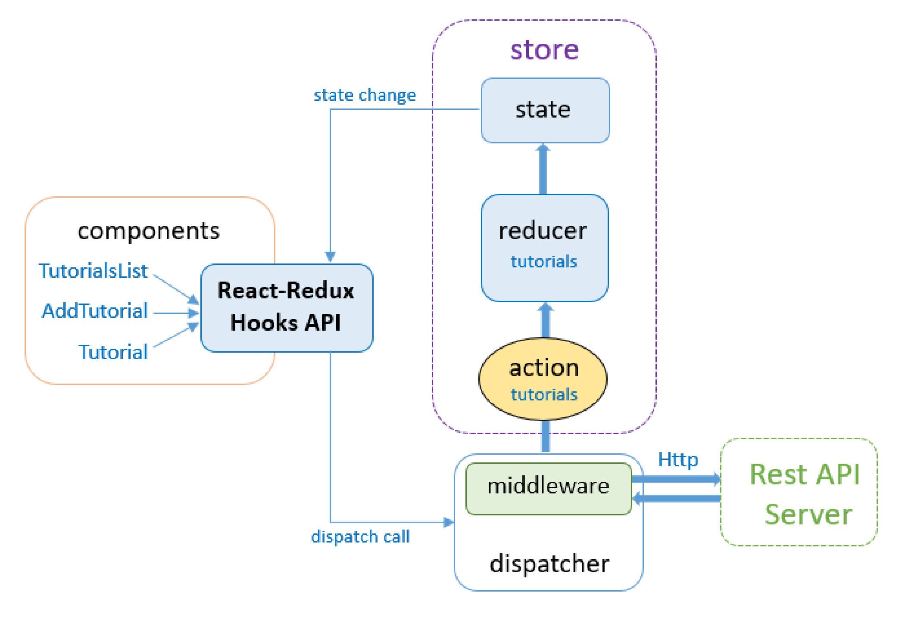
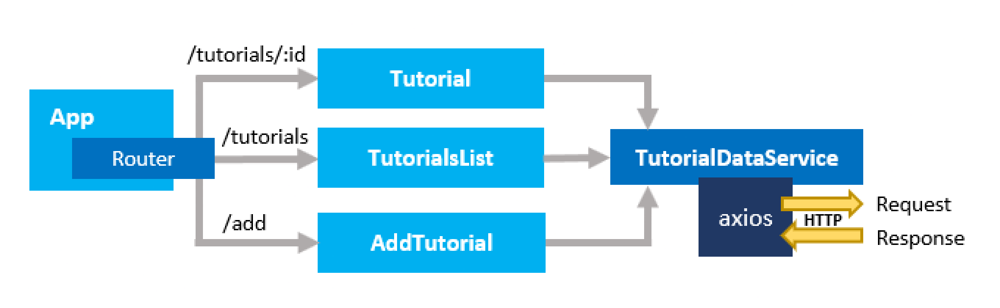

# react-tutorial-microservice



## Project Overview :globe_with_meridians:	
In this project we will create 2 microservices with a aggregator service which combines data from the two microservice and displays it in a meaningful manner. We will be using `spring boot` as our backend and `reactJS` as our frontend. Note: Both microservices would havee 2 different types of databases, MongoDb and MySQL.

## Prerequisites :white_check_mark:
- [x] Installation of NodeJS - https://nodejs.org/en/download/
- [x] Installation of Yarn locally - https://classic.yarnpkg.com/lang/en/docs/install/#windows-stable

## Getting Started - Installation :computer:

```
1.  git clone https://github.com/Chabbax/without-create-react-app.git
2.  yarn
3.  yarn start dev
```

## Backend Repository :house_with_garden:
- Microservice 1 : https://github.com/Chabbax/spring-tutorial-microservice.git
- Microservice 2 : In-progress


## Internal Architectural Diagrams


